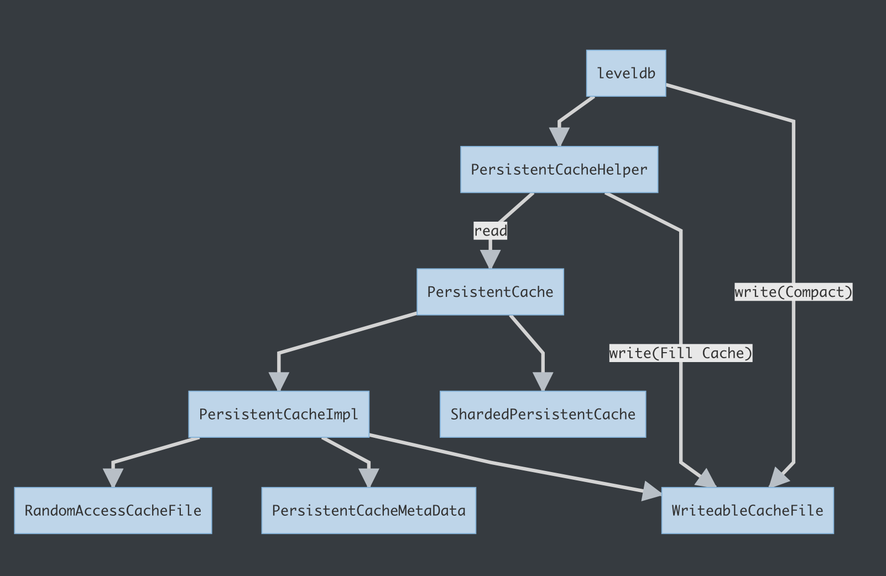
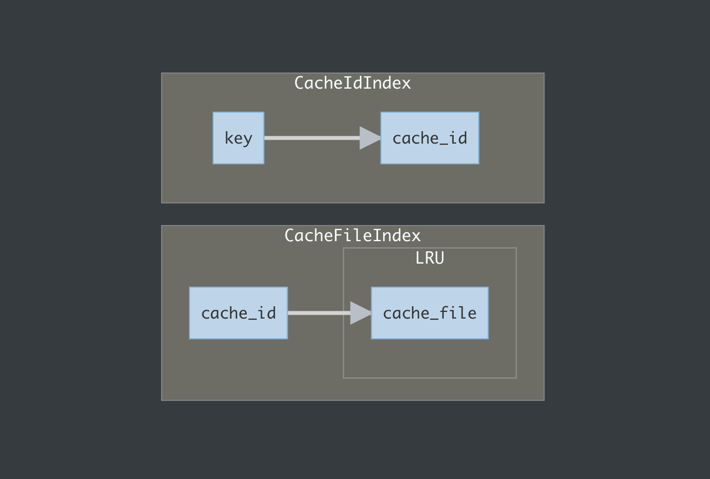

## Persistent Cache 设计

Tera 的 PersistentCache 设计借鉴了 rocksdb 同名模块，但因为各种各样的原因，rocksdb本身的persistent cache基本不可用，因此 Tera 在此基础上做了较大幅度的改动，以满足需求。

### 主要feature

1. 确保数据不会超出SSD磁盘容量。
2. 对于SSD容量不足的场景，以文件为粒度，做LRU淘汰。
3. 在SSD容量充足的情况下，读写性能与直接使用SSD持平。
4. 支持单机多磁盘容量异构的场景。
5. 支持从老版本 FlashEnv 的场景无感切换到 PersistentCache 场景。
6. 定期GC垃圾文件。

### Server 端配置说明

- tera_persistent_cache_paths: 设置 persistent cache 所使用的ssd盘路径，支持多路径，如/home/ssd1;/home/ssd2，分号分割。

- tera_persistent_cache_write_retry_times: Cache打满后，如果所有文件都被引用无法淘汰的情况下，重试分配空间的次数，默认5次，间隔1s。通常用户无需关心。

- tera_enable_persistent_cache: 设置是否开启persistent cache，默认使用flash_env。

- tera_enable_persistent_cache_transfer_flash_env_files: 设置是否迁移 flash_env 的 cache 文件，如果为false，则删除所有不认识的cache文件，否则尝试将已有的 flash env 的cache文件拉入persistent cache中。

### 整体架构



如上图所示，Persistent Cache 的直接使用者就是leveldb。

### 接口说明

Persistent Cache主要提供了以下接口：

```c++
virtual Status NewWriteableCacheFile(WriteableCacheFile**, const std::string& path) = 0;
virtual Status Read(const Slice& key, size_t offset, size_t length, Slice* content, SstDataScratch* scratch) = 0;
virtual void ForceEvict(const Slice& key) = 0;
```

#### - NewWriteableCacheFile

向 Cache 写入内容主要调用的就是  **NewWriteableCacheFile** 接口，其中：

- WriteableCacheFile** 用于传出新建的CacheFile，

- path 指定存储该文件相对于 persistent_cache 路径的位置，真正创建的文件会在用户指定的文件名后拼接.*$cache_id*.rc

  **例：若persistent_cache的路径为/home/ssd0/persistent_cache，用户指定某一个cache文件创建路径为table/tablet00000001/0/123.sst，若此时的cache_id是386，最终该文件会被创建在 /home/ssd0/persistent_cache/table/tablet00000001/0/123.sst.386.rc**

  该特性主要用于保留tera本身的结构化路径，方便问题的定位和追查。

  该接口会在 Cache 系统内创建一个 **WriteableCacheFile** 返回给用户，该 **WriteableCacheFile** 主要接口如下：

```c++
Status Append(const Slice&) override;
void Close(const Slice& key);
void Abandon();
```

对用户来说，写Cache文件需要调用Append接口，语义同WriteableFile的语义，主要对另外两个接口作出说明：

1. Close： 当用户写入Cache文件结束后，如果认为没有问题，可以通过调用Close接口，直接关闭Cache文件，并给定key。后面可以通过 PersistentCache 的 Read 接口，指定 key，偏移量，和长度来读取该文件的内容。
2. Abandon：当用户写入Cache文件发生失败，希望丢弃文件时使用，该文件不会被插入Cache中，而是后期随着GC被淘汰。主要可能的错误包括：
   1. Cache写满且无文件可淘汰，返回 IOError。
   2. 其他写文件系统的错误。

在leveldb模块中，只有一个地方直接写新Cache文件，即做Compact时，生成新的文件同时会写一个新的 Cache 文件。其他需要充cache的写操作由 **PersistentCacheHelper** 封装执行。

#### - Read

Read接口如前所述，对于插入PersistentCache中的文件来说，通过指定的文件key, offset, length可以直接读取该文件指定区域的内容。

#### - ForceEvict

对于PersistentCache来说，通常在Cache写满后才进行文件粒度的LRU淘汰，但是SSD盘的性能会随着容量增加而逐渐下降，为了确保尽快的干掉无用文件，可以通过ForceEvict接口，强行删除Cache内指定key对应的文件。分为两种情况：

1. 如果该文件无引用，则直接删除。
2. 如果该文件正在被引用，则推入 **evictable** 队列，在此之后，通过任何途径都无法再次查询/引用到该文件，并在周期性的GC中，在其引用计数为0后删除。

该接口在 leveldb 中，有两个调用的地方：

1. 从Cache中读取某个sst文件的block时，如果读取成功但ParseBlock失败，则认为该文件内容失效，调用ForceEvict清理该文件后，从dfs读取，如果dfs读取到block并且Parse成功，则重新充该文件。
2. Compact结束后，对于确定需要删除的文件，调用该接口直接淘汰。

### 各模块详细说明

#### PersistentCache

接口定义，虚类，主要接口已说明

#### PersistentCacheMetaData

该结构用于维护PersistentCache的元数据信息，其内部实现主要就是两个HashTable。分别建立了以下映射关系：



如上图所示，MetaData中维护了key->cache_id的映射，以及 cache_id 到 cache_file 的映射，这部分数据同时使用dbtable持久化在磁盘上，供程序重启后使用。同时，cache_file本身被串成了一个 lru list，用于 cache 打满后淘汰。

#### PersistentCacheImpl

单盘上的 **PersistentCache** 实现，其内部主要维护了 **PersistentCacheMetaData** 和当前Cache的使用量，当前CacheFile的 Id 等信息。

其对PersistentCache的各个接口实现细节主要如下

```c++
virtual Status NewWriteableCacheFile(WriteableCacheFile**, const Slice&) = 0;
```

该接口被调用时，会依次进行以下步骤：

1. 创建一个新的CacheFile，文件名为 {cache_id}.rc ，其中cache_id在单盘上全局递增，永不重复，由PersistentCacheImpl维护。
2. 在metadata中建立cache_id -> cache_file 的映射（此时用户还无法读到该文件）。
3. 将文件返回给用户使用。


```c++
virtual Status Read(const Slice& key, size_t offset, size_t length, Slice* content, SstDataScratch* scratch) = 0;
```

该接口被调用时，会依次进行以下步骤：

1. 在MetaData中查找 key 对应的 cache_id。
2. 如果找到，继续通过 cache_id 查找对应的 CacheFile。
3. 如果找到，读取CacheFile中对应 offset / length 的内容。
4. 以上任意一步失败，认为Cache Miss，如果读取文件错误，认为Cache Error。

```C++
virtual void ForceEvict(const Slice& key) = 0;
```

该接口被调用时，会转发给 PersistentCacheMetaData 的 ForceEvict 接口，并依次进行以下步骤：

1. 删除 MetaData 中对应 key -> cache_id 的映射（如果有）。
2. 删除 MetaData 中对应 cache_id->cache_file 的映射（如果有）。
3. 如果 cache_file 的引用计数为0，直接将文件返回给 PersistentCacheImpl，供其删除并释放Cache空间。
4. 否则，将 cache_file 加入 evictable 文件列表，等待gc时尝试删除。

#### WriteableCacheFile

该模块主要功能和接口已在上文全局中介绍，以下是其实现细节。

```c++
Status Append(const Slice&) override;
```

该接口被调用时，会依次进行以下步骤：

1. 向 PersistentCacheImpl 申请与 Slice 等大的 Size。
2. 申请成功后写入文件。
3. 申请失败，等待1s后重试，最多重试5次，失败后返回错误。

```c++
void Close(const Slice& key);
```

该接口调用时，认为写入Cache文件成功，建立key -> cache_id的映射，从此之后用户可以通过Cache读到该文件的内容。（cache_id -> cache_file)的映射在之前创建文件的时候已经建立。并将 key->cache_id的映射落盘持久化，待重启恢复。

```c++
void Abandon();
```

该接口调用时，认为Cache文件有错误不可用，直接抛弃，删除cache_id->cache_file的映射，并将文件推入 evictable 文件列表，等待gc。

#### RandomAccessCacheFile

基本等同于posix的RandomAccessFile，在WriteableCacheFile做Close操作时，由于env不支持同一个文件又读又写，因此会关闭该文件，并读打开为RandomAccessCacheFile，存入Cache中。

#### ShardedPersistentCache

用户层真正Work的PersistentCache实例，主要作用是多盘&异构容量的支持，由ShardedPersistentCache维护多个PersistentCacheImpl实例，通常每一个PersistentCacheImpl实例对应底层的一块儿SSD存储介质。

- Open：Open一个ShardedPersistentCache时，会由他Open一系列的PersistentCacheImpl，并通过GetAllKeys()接口去恢复每一个key到对应PersistentCacheImpl的映射关系。

- Read: Read操作会根据 key=>persistent_cache_impl的映射关系，读取对应的SSD上的缓存文件。

- NewWriteableCacheFile: 当调用NewWriteableCacheFile时，会根据Pick策略，选取一个PersistentCacheImpl，调用NewWriteableCacheFile去创建Cache文件。

##### Pick 策略

ShardedPersistentCache在新建Cache文件时，依据以下策略进行抉择：

1. 如果有 >= 1块盘使用量不足90%，则在所有使用量低于90%的盘中随机选取。
2. 否则，选取剩余空间最大的盘创建。

以上策略依据是，考虑有两块SSD磁盘：

1. 当双盘都空闲时，做性能上的考量，将文件尽可能的等份到两块盘，在考虑随机读取的场景下，这样能尽可能发挥双盘的性能优势。如果数据在两块盘上分布不均，那么随机读取时，有可能一块盘已经被打到极限，而另一块盘没什么压力。
2. 当双盘有一块使用量大于90%时，考虑两块盘size可能不同，为了尽可能利用SSD空间，此时选取其他使用量低于90%的盘进行插入。
3. 直到所有盘容量都大于90%后，从剩余容量最多的盘中进行选取。

#### GC策略

由于tera是分布式表格系统，随着数据分片的迁移，某台ts上的缓存信息很可能是作废的，为了尽快回收掉作废的缓存信息，按照以下策略周期性进行GC：

1. 通过 GetAllKeys() 接口获得当前PersistentCache中的所有key。

2. 对于以下两种情况对应的key，保留其Cache文件。

   1. 在此台ts上的tablet所对应的key。
   2. 在此台ts上的tablet所继承的其他tablet的文件。

   而对于其他的key来说，通过ForceEvict接口直接淘汰。

3. 在此之后，调用PersistentCache的GarbageCollect()接口，寻找metadata中引用计数为 0 的 evictable 文件并删除。

附：在PersistentCache中的key格式：
*$table_name*/*$tablet_name*/*$lg_id*/xxx.sst

#### 从env_flash 迁移方案
对于persistent cache来说，如果需要从env_flash继承已存在的cache文件，可以通过以下配置方式来完成。

**--tera_enable_persistent_cache=true**

**--tera_enable_persistent_cache_transfer_flash_env_files=true**

以上就是全部配置，迁移过程中，会对当前路径下的所有已存在文件做遍历，对于满足 $persistent_cache_path/*$table_name*/*$tablet_name*/*$lg_id*/xxx.sst格式的文件（即flash env的文件）来说，会对他们进行以下操作：

1. 分配cache_id。
2. 重命名文件为*$table_name*/*$tablet_name*/*$lg_id*/xxx.sst.*$cache_id*.rc。
3. 读打开文件，并在persistent_cache中分配和文件size相同大小的容量。
4. 将文件插入cache中接管。

对于其他文件，会在open persistent cache之后进行删除。
