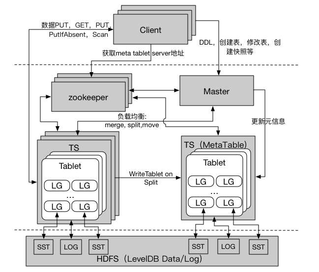
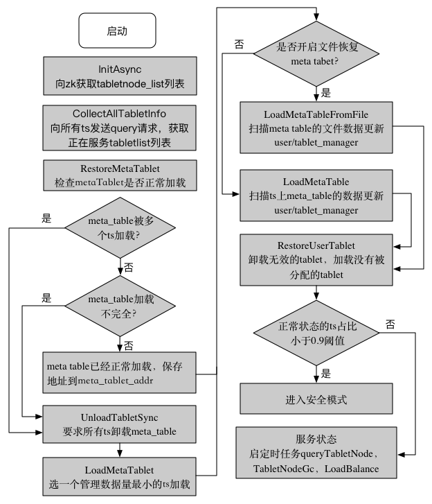
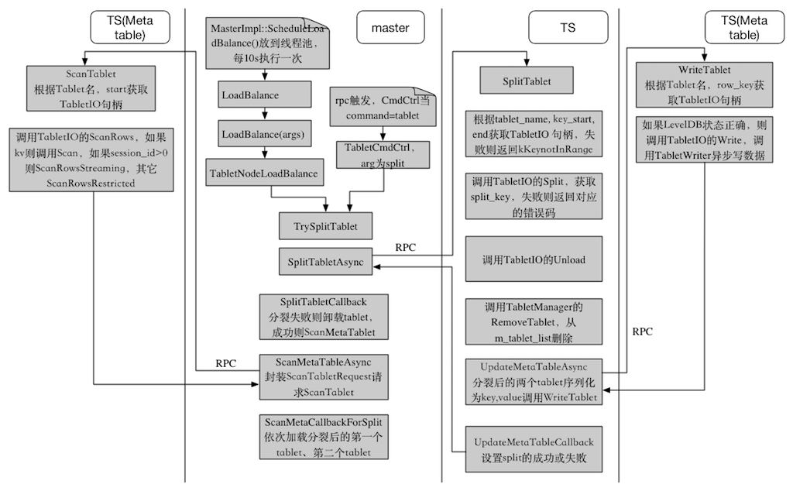

tera开发者黄俊辉的串讲文档
===========================
我最近转岗到openSeArch组，接手tera相关开发工作。这个文档整理自我在2015.12.3在组内做的串讲报告。

## tera 背景
1. 基于hadoop的mapreduce实现的链接系统实效性比较差，不能做到实时、增量计算；
2. 内部的DDBS系统存在不能自动负载均衡、不支持scan操作等问题；

## tera 架构

- tera系统包括5部分：一个master节点，若干个tablet server（TS），client（SDK），zookeeper集群，分布式文件系统；
- 在所有的TS节点里，有个除了管理普通的tablet外，还会被master选择加载meta表的数据；
- meta表是不能被分裂的，所以meta只会有一个tablet，也即是只有一个TS加载了meta表；

## tera 架构特点
- 强一致性、全局有序、列存储，以列族为单位可指定SSD/磁盘/内存；
- 自动负责均衡，记录多版本；
- CP系统，不是高可用系统；
- 目前支持单行事务，暂不支持跨行、跨表事务；
- 缺少类SQL查询语言，目前正在开发中；

## tera 各模块的功能
1. zookeeper
 1. 保证任何时候最多只有一个tera master；
 2. 保存meta table的地址信息；
 3. 保存当前在线的TS信息；
 4. 保证TS可以被踢走；
2. master
 1. 分配tablet给TS；
 2. 监控TS的加入和退出；
 3. 维持tera系统的负载均衡；
 4. 回收没有用的文件系统数据；
 5. 处理client对表格、快照的操作请求；
3. TS
 1. 管理一系列tablet，一般有10~1000个tablet；
 2. 处理client发过来的tablet读写请求；
4. client
 1. 通过zookeeper上的meta信息，找到meta table所有的TS地址；
 2. 读写请求直接与TS交互；
 3. 对表的创建、修改、删除，对快照的操作直接与master交互；
5. 分布式文件系统
 1. 存储leveldb的sst文件、log文件等；

## tera 数据模型与leveldb的数据模型的映射关系
- tera是表格的数据模型，leveldb是kv的数据模型，tera是基于leveldb的存储系统，所以这里涉及到表格数据转换成kv结构的问题；
- tera的表格至少有一个LG，一个LG有一个或多个CF，一个LG对应一个leveldb的对象；
- leveldb的Key结构是|user\_key|sequence(7Bytes)|type(1Bytes)|，排序方法是首先user\_key升序，然后sequence降序，最后type降序。其中user\_key是用户key序列化后值，sequence是操作的时间顺序，type是操作类型（写入或删除）；
- 在tera里，有四种key类型：
 - Readable: rowkey，qualifier都是字符串类型，没有\0；
 - Binary: rowkey或qualifier包含\0字符，规定cf不能包含\0；
 - TTLKv: 带过期时间的KV类型；
 - GeneralKv: 没有过期时间的KV类型，leveldb原生支持这一类；
- 不同key类型，组成的user\_key也不同：
 - Readable: [rowkey\0(rlen+1B)|column\0(clen+1B)+qualifier\0(qlen+1B)|type(1B)|timestamp(7B)]
 - Binary: [rowkey(rlen)+column\0|qualifier|type|timestamp|rlen|qlen]
 - TTLKv: [rowkey(rlen)|expire\_timestamp(4B)]
 - GeneralKv: user\_key == key
 - 写操作时，不同LG的数据是写到同一个log文件的，为提高恢复的效率，需要把LG的id和上面序列化生成的tera\_key一起写到日志中，具体格式是：
  [9(4B)|//LG\_ID//|lg\_id|klen|tera\_key]

## tera meta 表结构
 - meta表是tera的核心表，维护了整个系统当前有哪些表，每个表的模式，每个tablet的信息，每个CF的访问控制信息；
 - meta表不能被分裂，只有一个tablet，且只有一个LG，名字是lg\_meta，不带压缩，以内存为存储介质（数据持久化在NFS上）；
 - meta表实际上是一个KV结构类型，有3种类型的key，以key的首字符区分：'~'开头的是user相关的记录，'@'开头的是table相关的记录，大于'@'是tablet相关的记录，其它的无效；
  - user 相关的记录，key的结构是'~'+用户名，value是以PB封装UserInfo的数据，TODO；
  - table 相关的记录，key的结构是'@'+表名，value是以PB封装TableMeta的数据，TableMeta包含表名，状态，模式，快照，创建时间等信息；
  - tablet 相关的记录，key的结构是表名+'#'+row\_key\_start，value是以PB封装TabletMeta的数据，TabletMeta包含表名字，tablet的路径，所属的ts地址，状态等信息；

## master 启动流程

1. MasterEntry::StartServer，调用MasterImpl::Init，初始化zk句柄，设置master的状态为kIsSecondary，步骤调用MasterImpl::InitAsync;
 1. MasterImpl::InitAsync，向zk获取正在工作的tabletnode列表，依次执行步骤2,3;
 2. MasterImpl::CollectAllTabletInfo，向所有在线的ts发送query请求，获取已经加载的tabletlist列表;
 3. MasterImpl::RestoreMetaTablet，遍历tabletlist，如果meta表被多个ts加载或加载不完全，则要求所有已经加载meta表的ts卸载。如果卸载失败，则强制踢出该ts。然后，选一个管理数据量最小的ts加载meta表，保存meta表的地址meta\_tablet\_addr。如果前面已经正确加载了meta表，则直接保存meta表的地址meta\_tablet\_addr；如果开启从本地文件恢复meta表的标记，则调用LoadMetaTableFromFile把meta表的数据加载到本地内存，同时，要求已经加载meta表的ts清空meta数据，然后用本地内存的数据同步到meta表里，操作结束则返回; 如果没有开启恢复meta表，则调用LoadMetaTable把meta表的数据同步到master的内存;
 4. MasterImpl::LoadMetaTable，通过向ts发送scan请求扫描meta表，如果row的首字符是'~'，则是用户相关的元信息执行UserManager::LoadUserMeta，如果是'@'，则是表格相关的元信息执行TabletManager::LoadTableMeta，如果是>@，则是tablet相关的元信息执行TabletManager::LoadTabletMeta;
 5. 在zk上更新meta表所有ts的地址;
 6. MasterImpl::RestoreUserTablet，遍历所有tablets，如果没有加载，则找一个ts加载；如果能正常工作的ts占比小于0.9阈值时，则master进入安全模式，否则启动定时任务:QueryTablet, TabletNodeGc, LoadBalance，并进入服务状态;
2. 注册RPC服务，并启动。

## tablet 分裂流程

- master发现tablet的大小超过某阈值（默认512M），会触发split操作；
- master发现某tablet的负载超过平均负载的某阈值时，会触发split操作(目前未实现)；
- 用户通过SDK主动触发split操作。
- TS收到split请求后，需要在Tablet里找一个中间的key对其一分为二，具体找的方法是：
 1. 在Tablet里所有的LG中找一个数据量最大的，在这个LG里找待分裂的split\_key；
 2. 获取LG除level-0外的所有level的数据量大小总和size，确定分裂的数据量大小0.5*Size；
 3. 从level-1到level-6，找一个largest key最小sst，把这个sst的大小累加到split\_size，如果达到要求则执行步骤4，否则继续这一步骤的流程；
 4. split\_key就是步骤3得到的最后一个largest key；
 5. 对于普通KV类型的key，上述split\_key就是最终所要的key，对于表格类型需要从中提取出rowkey作为split\_key；
- tablet的分裂只是修改了元信息，没有发生真实数据的移动，为实现这点leveldb需要做什么？
 1. 分裂后产生两个新的tablet，需要在它们的TabletMeta结构parent\_tablets里分别填写原tablet的tabletnum；
 2. TS收到需要Load命令后，如果parent\_tablets的个数为1，则认为这个tablet是分裂而来的，通过读取父tablet的CURRENT文件，在自己的DB目录下生成MANIFEST；
 3. 通过MANIFEST文件，tablet就知道自己有哪些sst文件，每个sst属于哪一级，以及每个sst的最小最大值；
 4. 对于原来的tablet的sst文件，leveldb是不会移动到自己DB目录下的，后面compact操作生成的新文件会保存到自己的DB目录；
 5. TS无法知道什么时候应该删除父tablet的sst文件，因为虽然自己没有用父tablet的sst文件了，但是可能由另一个分裂出来的tablet使用，这个只能由master定时向TS发送GC请求，收集仍然在用的sst文件，同时，master通过list命令得到tablet下所有的文件，两者的diff就是需要删除的文件。

## tablet 合并流程

- master发现tablet的大小小于某阈值时，触发merge操作。
- 同分裂一样，tablet的合并也只是修改了元信息，leveldb在load tablet时，如果parent\_tablets的个数为2，则认为这是merge过来的tablet，需要读取两父tablet的CURRENT文件，在自己的DB目录下生成MANIFEST。
- 同样，删除父tablet没用的数据，也是由master负责的。

## tablet 读数据流程

1. 遍历Tablet请求的每一行，根据tablet\_name，start\_key找到对应的TabletIO的句柄；
2. 调用TabletIO的ReadCells，并保存结果；
 1. 如果只是kv类型，调用DBTable的Get，即调用leveldb的Get，其它类型进入步骤2；
 2. 如果请求里有一个qualifier为空，即没有指定qualifier，则不能执行seek，即需要调用scan操作，否则调用seek；
  - 新建一个迭代器，该迭代器内部包含了tablet里所有LG的迭代器；
  - 指定row\_key, cf="", qualifier="", type=TKT\_FORSEEK, timestamp=INT64\_MAX, 把迭代器移动行首；
  - 先遍历cf，然后在每个cf里遍历qualifier，调用ScanDrop检查是否需要跳过当前的记录，如果记录是有用的，则检查是否是原子操作，如果是就合并该key的所有value，如果不是原子操作，当前value就是最终需要的；
3. 返回结果；

## tablet 写数据流程
1. 预处理待写的数据，生成由TabletIO到index的映射；
2. 对每一个TabletIO调用write方法；
3. 调用TabletWriter::Write，如果m\_stopped，则设置错误码为kAsyncNotRunning；如果active buffer缓存的数据量超过阈值MAX\_PENDING\_SIZE或tablet\_busy（只要tablet下面的某个LG对应leveldb的level-0的文件个数超过某阈值时则认为busy），则设置错误码为kTabletNodeIsBusy；否则把数据放到active buffer。检查active buffer数据是否超过阈值或请求是否是立即类型，如果是则触发写操作；

## tablet 后台写线程
1. 检查是否需要切换buffer，不需要则sleep，否则进入步骤2；
2. 调用TabletWriter::FlushToDiskBatch，调用BatchRequest把数据用leveldb::WriteBatch结构封装，BatchRequest函数对于表格类型的数据，把key封装成[lgidlen(4B)|//LG\_ID//|lg\_id(4B)|klen(4B)|tera\_key]，其中"//LG\_ID//"是固定的字符串，lgidlen是接下来字符串的长度，值是9，lg\_id是后面的terakey属于哪一个LG；进入步骤3；
 - 这里封装的key后面会直接写入到日志文件中；
 - 封装的原因：原生的leveldb，一个db就有一个log文件。但是，在tera里一个tablet对应一个log文件，即多个db的数据会写到一log文件，所以需要在log文件里区分每个db的数据；
3. 调用TabletIO::WriteBatch，进入步骤4；
4. 调用DBTable::Write，使用RecordWriter封装数据，然后放到队列std::deque&lt;RecordWriter\*>尾端，等待前面的数据写完成，然后依次执行如下步骤；
 1. 调用DBTable::GroupWriteBatch，把std::deque&lt;RecordWriter*>里的数据追加到WriteBatch实例，如果队列头的数据是不需要sync日志的，但是当前的数据是需要sync，则结束追加数据。同时，这里限制一次批量写的数据量，默认是1M；
 2. 如果force\_switch\_log\_或日志大小超过阈值32M（tera\_tablet\_log\_file\_size），生成新日志文件；
 3. 数据追加到log文件里，如果写日志超时（默认5s，tera\_tablet\_write\_log\_time\_out），切换日志文件；写日志成功后，执行sync操作，等待sync操作完成，如果sync超时，切换日志文件，重新执行这一步骤；
 4. 对每个lg保存最后一次写的快照序；
 5. 把步骤2生成的WriteBatch分到不同的lg上，对每一个lg调用DBImpl::Write操作，把数据写入memtable；
 6. 释放最后一次提交的快照；更新最后一次提交的序号commit\_snapshot\_，这样读操作就能读到最新的数据；

## tera compact的触发条件
1. 用户通过SDK向TS发送compact请求；
2. 写数据时，memtable满了，变成immutable memtable，触发compact流程；
3. 读数据时，在memtable和immutable memtable都没有读到数据，且文件的allowed\_seeks小于等于0且file\_to\_compact为null时，触发compact流程；
4. 触发compact流程后，首先检查compact的分数是否大于等于1，如果是则进入compact操作，否则检查是否因seek导致compact，如果是则进入compact操作，其它情况不需要compact；

## tera compact的流程
1. 计算compact的分数的方法：
 - 对level-0来说，score=当前level-0的文件个数/2；
 - 对其它level来说，score=当前level的总字节大小/每个level配置的字节上限；(默认sst文件的大小是tera\_tablet\_ldb\_sst\_size=8M，level-1上限是5*8M=40M，接下来的level是10倍的关系)
2. compact操作对磁盘IO的读写压力比较大，所以每个TS同时compact线程数是有限制的，默认tera\_tabletnode\_compact\_thread\_num=10。分数越高，compact的优先级越高；
3. compact的输入是level上的一个或若干没有重合的sst或者若干个有重合的sst文件（只有level为0时，才可能有多个重合的sst），以及level+1上的若干个与之有重合的sst文件，输出是level+1上多个新sst文件。具体参与compact文件的选择：
 - level上参与compact的文件是轮询的（由compact\_pointer\_变量保存下一个需要compact的sst文件），轮询结束则从头开始选第一个文件；
 - level+1上选sst落在[begin, end]范围内的文件，即是有重合的文件；
 - 选定level+1上的文件后，基于level和level+1的merge后的[smallest, largest]范围在level上找出所有重叠的文件数，然后得到更新的范围[smallest, largest]，拿这个范围在level+1上找出所有重叠的文件数，如果level+1在扩展前和扩展后的文件个数相同，则用扩展后的两组文件作为compact的输入，否则用上面两个步骤得到的两组文件作为compact输入；
 - level+2上选sst落在level和level+1的merge后的[smallest, largest]范围内的文件，由std::vector<FileMetaData*> grandparents\_保存；这个变量主要是用来判断是否需要生成新sst、判断compact操作是否可以通过简单的move操作完成的依据；
4. 选定compact的文件后，就进入真正compact操作。如果不是人工触发的compact，且检查发现可以通过简单的move文件完成compact的，则直接调用LogAndApply在manifest文件里记录这种变化：level+1有这个文件，level没有这个文件；对其它情况，进入步骤5；
5. 对生成需要compact的两组sst文件，生成一个迭代器，遍历迭代器：
 - 如果immutable memtable有数据，则优先dump当前immutable memtable的数据到level-0的sst上。这样做是为了避免因为compact，导致前端写数据堵塞；
 - 如果把当前key写入sst文件，会导致level+1与level+2重叠的字节超过10*sst大小，则认为重叠部分过大，就停止对这个sst文件的写入，生成一个新sst文件；
 - 检查当前的key是否需要丢弃，如果是，则next下一个key；
 - 对于有用的key，如果key的类型是原子操作，则merge之前所有值，把merge的结果加到builder里，否则直接把key和value加到builder里；
 - 检查当前sst的大小是否超过阈值，如果是，就关闭当前sst文件，生成新sst；

## 业界的进展
tera 是一个类似bigtable，hbase的NoSQL系统，所以可以借鉴这些系统的优点。目前hbase的进展主要是在可用性上。

- hbase基于timeline一致性为读操作提供高可用，99.9%提升到99.99%，[参考链接](http://hortonworks.com/blog/apache-hbase-high-availability-next-level/)；
 - 一个tablet只能由一个主ts写，但可以由多个从和主ts读；
 - 从ts实时tail主ts更新的日志文件，更新自己的memtable数据；
 - 客户端请求时通过指定一致性的要求（STRONG或TIMELINE）决定读请求到主ts还是从ts；
- facebook开发HydraBase进一步提供高可用，99.99%提升到99.999%，[参考链接](https://code.facebook.com/posts/321111638043166/hydrabase-the-evolution-of-hbase-facebook/)；
 - 解决跨机架、跨机房的容灾；
 - 基于RAFT实现副本的一致性；

另外，mongodb是近年比较流行的NoSQL系统，其功能越来越强大！在最新3.2版增加了内存存储引擎、数据加密、支持与第三方BI连接，[参考链接](https://www.mongodb.com/mongodb-3.2)