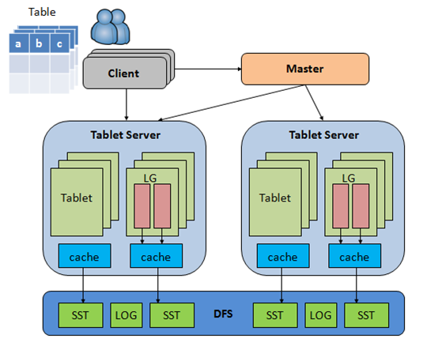

[高性能、可伸缩的结构化数据库](http://github.com/baidu/tera)
====
Tera是一个高性能、可伸缩的结构化数据存储系统，被设计用来管理搜索引擎万亿量级的超链与网页信息。为实现数据的实时分析与高效访问，我们使用按行键、列名和时间戳全局排序的三维数据模型组织数据，使用多级Cache系统，充分利用新一代服务器硬件大内存、SSD盘和万兆网卡的性能优势，做到模型灵活的同时，实现了高吞吐与水平扩展。([English](README.md))

# 特性
 * 全局有序
 * 热点自动分片
 * 数据强一致
 * 多版本,自动垃圾收集
 * 按列存储,支持内存表
 * 动态schema
 * 支持表格快照
 * 高效随机读写

# 数据模型
Tera使用了Bigtable的数据模型，可以将一张表格理解为这样一种数据结构：
```
map<RowKey, map<ColummnFamily:Qualifier, map<Timestamp, Value> > >
```
其中RowKey、ColumnFamily、Qualifier和Value是字符串，Timestamp是一个64位整形。ColumnFamliy需要建表时指定，是访问控制、版本保留等策略的基本单位。

# 系统架构
系统主要由Tabletserver、Master和ClientSDK三部分构成。其中Tabletserver是核心服务器，承载着所有的数据管理与访问；Master是系统的仲裁者，负责表格的创建、schema更新与负载均衡；ClientSDK包含供管理员使用的命令行工具teracli和给用户使用的SDK。
表格被按RowKey全局排序，并横向切分成多个Tablet，每个Tablet负责服务RowKey的一个区间，表格又被纵向切分为多个LocalityGroup，一个Tablet的多个Localitygroup在物理上单独存储，可以选择不同的存储介质，以优化访问效率。



# 系统依赖
 * 使用分布式文件系统（[BFS](https://github.com/baidu/bfs)、HDFS等）持久化数据与元信息
 * 使用分布式协调服务（[Nexus](https://github.com/baidu/ins/)或者Zookeeper）选主与协调
 * 使用[Sofa-pbrpc](https://github.com/baidu/sofa-pbrpc/)实现跨进程通信

# 系统构建
sh ./build.sh  
参考[BUILD](BUILD-cn)

# 使用示例

[体验单机Tera](doc/cn/onebox.md)

[通过docker体验Tera](example/docker)

[主要api使用方法](doc/cn/sdk_guide.md)

[客户端teracli使用方法](doc/cn/teracli.md)

[其它文档](doc/cn/README.md)

#反馈与技术支持
tera_dev at baidu.com

# 成为贡献者
阅读[RoadMap](doc/cn/roadmap.md)文件或者源代码，了解我们当前的开发方向。

完成[5个小任务](doc/to_be_a_contributor.md),帮你一步步成为tera贡献者。

# Become a Committer

成为tera的committer，你需要知道的一些[规则](doc/cn/to_be_a_committer.md)。

# 欢迎加入
如果你热爱开源，热爱分布式技术，请将简历发送至： 
opensearch at baidu.com
